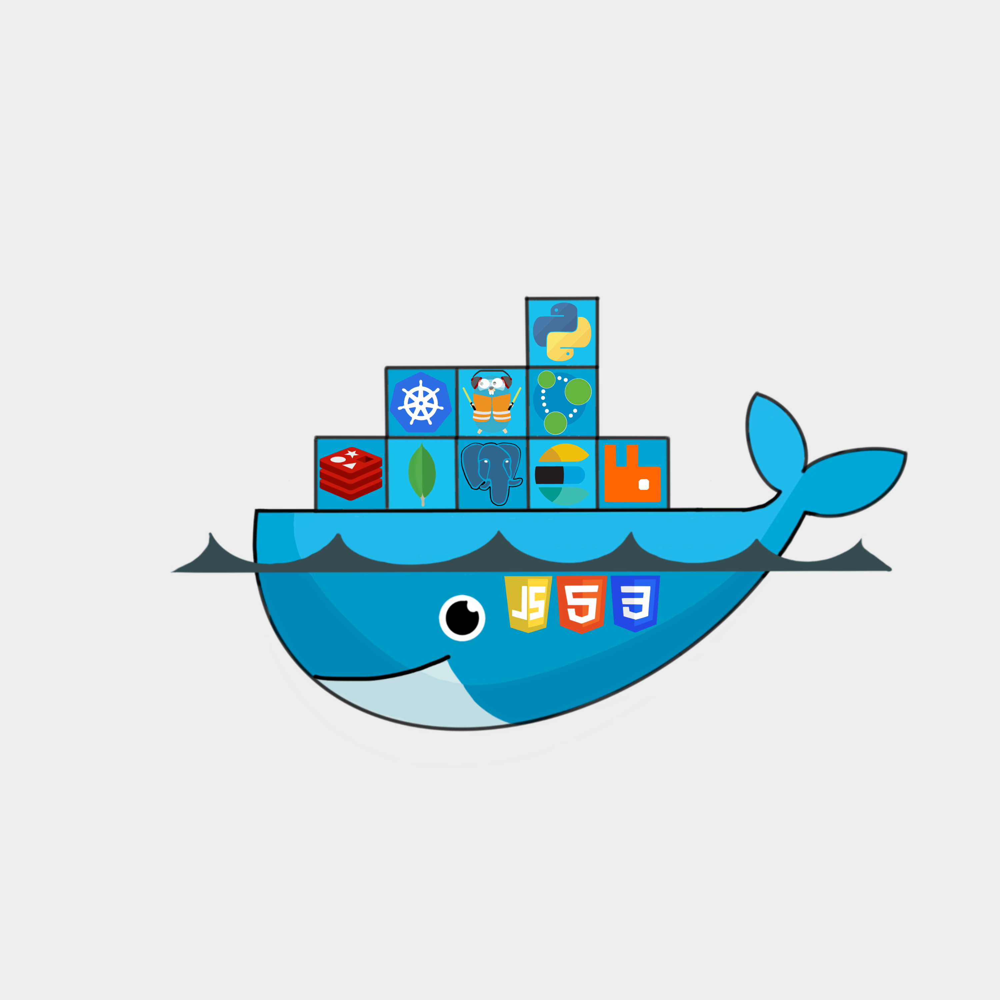

# Bigga (Community Edition)

Bigga (Community Edition): A generic Docker Compose boilerplate to deploy your microservices (optimized for Python)

This setup contains everything you need to get started with a single-instance, production-grade container deployment

Please get in touch with Reckonsys for the [Enterprise edition](#Enterprise-Edition).

### Featuring:

Blog post: [Reckonsys Engineering Blog](https://www.reckonsys.com/blog/bigga-a-generic-docker-compose-boilerplate-to-deploy-your-microservices-optimized-for-python/)

### Instructions

1. Fork this repo (So you can pull updates from us time to time)
1. Start new machine - `docker-machine create -d virtualbox dev`. [more drivers](https://docs.docker.com/machine/drivers/)
1. Configure your shell to use the new machine environment - `eval $(docker-machine env dev)`
1. Change the `build` paths in the `docker-compose.yml` file to point to your local repositories
1. Make sure that there is a [`.dockerignore`](.dockerignore) file in each of your repositories that ignores unwanted files/folders line venv, .git, node_modules folders, etc.
1. Build images - `docker-compose build`
1. Start services - `docker-compose up -d`
1. Create migrations - `docker-compose exec worker /usr/local/bin/python manage.py migrate` (Please ensure you are not running this command in backend and image that might receive traffic from traefik. Because you don't want a request  to come to this container and fail. )
1. Grab IP - `docker-machine ip dev` - and view in your browser

### Scaling

Suppose you want to run X `backend` containers and Y `worker` containers: `docker-compose scale backend=X worker=Y`

### S3 Based front-end deployment

Refer our S3 deployment guide: [S3_FRONTEND_DEPLOYMENT.md](S3_FRONTEND_DEPLOYMENT.md)

### Importing / Exporting Docker Machines

Use the `machine-share` npm package. Check out the docs on this GitHub repo: [bhurlow/machine-share](https://github.com/bhurlow/machine-share)

### Inspecting / Deleting Volumes

* To list your volumes: `docker volume ls`
* To inspect a volume: `docker volume inspect my_volume_name`
* To remove a volume: `docker volume rm my_volume_name`

Be sure to run `docker-compose down` before removing volume to prevent it from being activly used while deleting.

### Troubleshooting

Refer our troubleshooting guide: [TROUBLESHOOTING.md](TROUBLESHOOTING.md)

## More Docs:

#### [Front-end](docs/Frontend.md)
#### [Backend](docs/Backend.md)
#### [Docker-basics](docs/Docker-container-basics.md)
#### [Migrating to another RDS Instance](docs/another-rds-instance.md)
#### [DROP and CREATE a new DB on RDS](docs/recreate-rds.md)

## Pending Integrations

PaperTrail: https://github.com/gliderlabs/logspout

Jaeger: https://github.com/dhilipsiva/talks/blob/master/assets/2020-01-18/docker-compose.yml

# Enterprise Edition

Enterprise edition is a Production Ready setup which contains full-fledged Kubernetes support (So obviously support multiple instances across multiple regions), High-Availability configuration, Multi-Tenant configuration, Metrics and Priority Support.

Reckonsys offers paid support along with the Enterprise Edition of Bigga. Please contact [info@reckonsys.com](mailto:info@reckonsys.com) for more details.

Source: https://github.com/reckonsys/bigga
